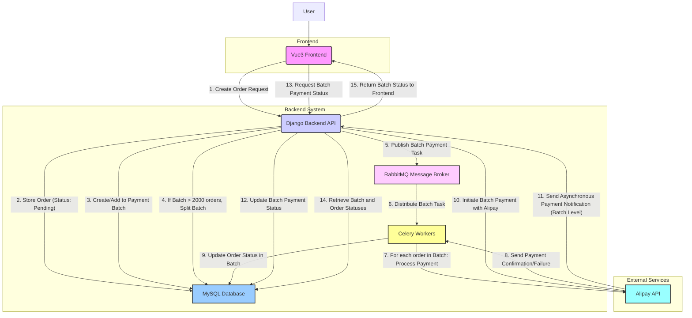

```mermaid
graph TD
    A[User] --> B(Vue3 Frontend)

    subgraph Frontend
        B
    end

    subgraph Backend System
        C(Django Backend API)
        D[MySQL Database]
        E[RabbitMQ Message Broker]
        F[Celery Workers]
    end

    subgraph External Services
        G[Alipay API]
    end

    %% Order Creation and Batching
    B -- 1. Create Order Request --> C
    C -- 2. Store Order (Status: Pending) --> D
    C -- 3. Create/Add to Payment Batch --> D
    C -- 4. If Batch > 2000 orders, Split Batch --> D
    C -- 5. Publish Batch Payment Task --> E

    %% Asynchronous Payment Processing
    E -- 6. Distribute Batch Task --> F
    F -- 7. For each order in Batch: Process Payment --> G
    G -- 8. Send Payment Confirmation/Failure --> F
    F -- 9. Update Order Status in Batch --> D

    %% Alipay Direct Interactions (Initiation and Notifications)
    C -- 10. Initiate Batch Payment with Alipay --> G
    G -- 11. Send Asynchronous Payment Notification (Batch Level) --> C
    C -- 12. Update Batch Payment Status --> D

    %% Batch Payment Status Retrieval
    B -- 13. Request Batch Payment Status --> C
    C -- 14. Retrieve Batch and Order Statuses --> D
    C -- 15. Return Batch Status to Frontend --> B

    %% Styling (Optional, for better readability)
    classDef frontend fill:#f9f,stroke:#333,stroke-width:2px;
    classDef backend fill:#ccf,stroke:#333,stroke-width:2px;
    classDef worker fill:#ff9,stroke:#333,stroke-width:2px;
    classDef db fill:#9cf,stroke:#333,stroke-width:2px;
    classDef mq fill:#fcf,stroke:#333,stroke-width:2px;
    classDef external fill:#9ff,stroke:#333,stroke-width:2px;

    class B frontend;
    class C backend;
    class F worker;
    class D db;
    class E mq;
    class G external;
```
